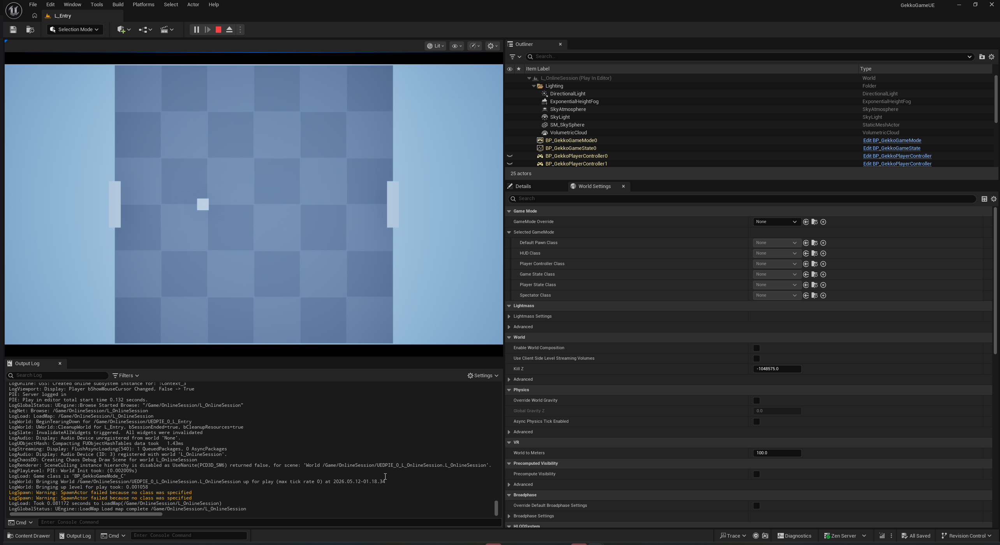

# GekkoGameUE
This is an Unreal Engine 5 port "GekkoGame", the Pong example from [GekkoNet](https://github.com/HeatXD/GekkoNet).
This uses the [GekkoNetUE](https://github.com/koenjicode/GekkoNetUE) plugin for networked matches and [RedoUE](https://github.com/koenjicode/RedoUE) for replay management.

## Setup
- Install Unreal Engine 5.7
- Install Visual Studio and the related game dependencies.
- Clone the repo using `git clone --recursive https://github.com/koenjicode/GekkoGameUE.git`.
- Generate the project files (Right click on the .uproject file).
- Follow the build instructions for GekkoNetUE [here](https://github.com/koenjicode/GekkoNetUE/blob/main/README.md).
- Open the .sln or .uproject file.

## Controls
This game can be played online or locally with either a keyboard or a controller.
- Arrow Keys | W,A,S,D | D-Pad | Analog Stick = Move Paddle
- Space Bar = Pause Simulation
- 1 = Increase Online Delay
- 2 = Decrease Online Delay
- 3 = Pull up network stats
- 4 = Exit Match
- 8 = Rewind Replay
- 9 = Fast Forward Replay
- 0 = Start/Stop Replay Takeover
